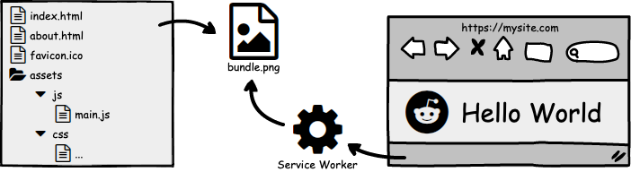

# Web2Img

Web2Img is a tool to bundle your web files into a single image, and extract them via Service Worker at runtime.

You can use image hosting sites as free CDNs to save bandwidth costs.



## Tool

Try It Online: https://etherdream.github.io/web2img/

https://user-images.githubusercontent.com/1072787/132183995-b342c3a8-1408-4819-923e-2d25fde419be.mp4


## Example

Demo: [https://fanhtml5.github.io](https://fanhtml5.github.io)

Target Files: https://github.com/fanhtml5/fanhtml5.github.io (only 2 files)

Source Files: https://github.com/fanhtml5/test-site

## FAQ

Q: What if JavaScript is disabled?

A: Unfortunately, the page can't be displayed. You can add a fallback in `404.html` such as:

```html
<noscript>
  <meta http-equiv=Refresh content="0;url=FALLBACK_URL">
</noscript>
<script src=/x.js></script>
```

----

Q: What if the browser doesn't support Service Worker?

A: Same as above. The program will read the contents of `<noscript>` and render them.

----

Q: Is free CDN safe?

A: Yes, the program will verify the data integrity.

----

Q: Is free CDN stable?

A: Not sure, but you can provide multiple URLs to improve stability.

----

Q: Can any free CDN be used?

A: No, CDN must enable CORS, allow empty referrer and "null" origin (or real value).

----

Q: Would it be better to optimize the image before uploading?

A: If the server will re-encode the image, it makes no difference.

----

Q: Why use `404.html`?

A: It's an easy way to intercept any path.

----

Q: How to update files?

A: Just overwrite `x.js`, the client polls this file every 2 minutes.

----

Q: Will new features be added?

A: This project is just an experiment, there is a new project named [freecdn](https://github.com/EtherDream/freecdn) which is much more powerful. (better docs will be released soon)


## License

MIT
